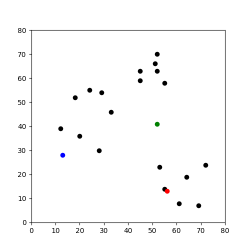
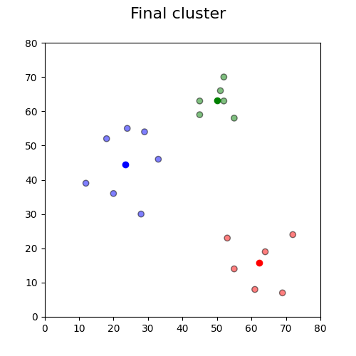

# k-means-python
Exemplo de implementação do algoritmo K Means.

Exemplo similar ao de [1], entretanto sem utilizar pandas. A implementação será base para segmentação de imagens, tornando mais simples a manipulação dos dados pelo numpy do que pelo pandas. Uma explicação com profundidade sobre o algoritmo K Means pode ser encontrada em [2].

O algoritmo cria e otimiza 3 clusters em uma lista de pares ordenados.

## Exemplo

Imagem original:

Clusters formados ao fim da execução, representados pelas cores (RGB):

# Referência

1. [Ben Alex Keen](https://benalexkeen.com/k-means-clustering-in-python/)
2. [Stanford CS221](https://stanford.edu/~cpiech/cs221/handouts/kmeans.html)